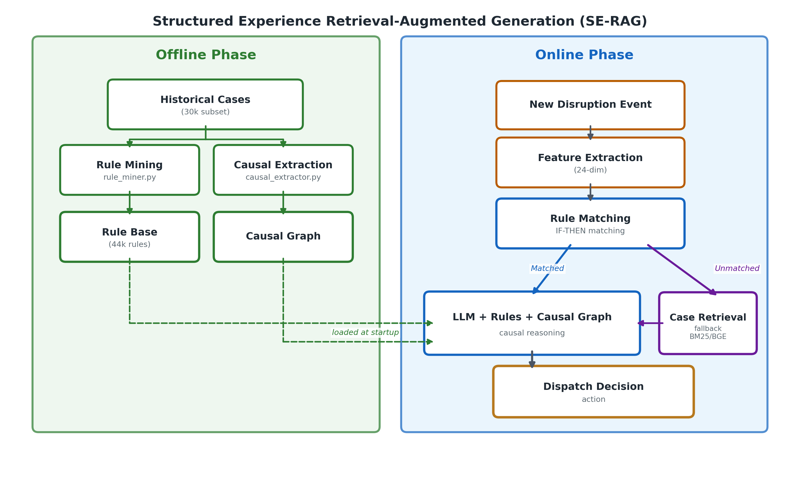

# Logistic-AI: SE-RAG for Logistics Anomaly Dispatch

> [🇬🇧 English](README.md) | [🇨🇳 中文](README.zh-CN.md)

结构化经验增强生成（SE-RAG）在物流异常调度中的研究框架。

[](https://arxiv.org/abs/xxxx.xxxxx)

---

## 核心问题

**物流异常调度是多解问题，不是分类问题。**

同一异常场景（如车辆故障、交通拥堵、订单取消）下，多个调度方案都可能合理 —— `delay_tolerant`、`reroute`、`reassign_order` 都是可接受的选项，取决于调度员偏好、车队状态、隐性约束。数据中 **~48% 的场景存在多个合法调度方案**，这不是数据质量问题，而是领域固有特征。

### 方法论对比

| 方法 | 为什么不适用 |
|---|---|
| 分类器 | 一对一 hard label 映射，天生不适用于多解空间 |
| 纯 LLM | 缺少领域经验，准确率远不够 |
| 标准 RAG (BM25/TF-IDF/Dense) | 检索零散个例，缺乏结构化引导，提升有限 |
| **SE-RAG（本方法）** | 规则 = 历史经验的模式提炼，LLM 在规则 + 因果链下做判断，保留多解空间 |

---

## SE-RAG 架构



### 离线阶段：知识构建

1. **规则挖掘** — 从 30k 历史案例中挖掘事件特征 → 行动决策的关联规则，统一特征表示空间，产出 ~44k 条原始规则
2. **因果图构建** — 提取特征与行动选择的因果强度关系，帮助 LLM 理解"为什么这个特征会影响行动"
3. **规则加权** — 针对 minority action（reroute, reassign_order, adjust_capacity）加权以缓解类偏
4. **规则裁剪** — conf ≥ 0.7, sup ≥ 5，保留 ~17k 条高质量规则

### 在线阶段：检索增强决策

1. 输入异常事件特征（事件类型、严重等级、负载率、紧急订单数等 24 维特征）
2. 规则匹配 + 因果推理信号检索
3. 组织 Prompt 上下文（规则证据 + 因果图 + 特征相似案例）
4. LLM 参考结构化证据输出最终调度决策

---

## 实验结果

### 主表（1000 queries, deepseek-v4-flash）

| 方法 | Multi-GT | Single (Exact) | 平均延迟 |
|---|---|---|---|
| **SE-RAG** | **90.4%** | **63.3%** | **7.09s** |
| bm25_rag | 86.9% | 54.9% | 8.80s |
| dense_rag | 76.6% | 30.4% | 8.81s |
| tfidf_rag | 80.1% | 45.3% | 8.86s |
| no_rag（纯 LLM） | 69.8% | 23.5% | 7.32s |

### Per-Action 表现（SE-RAG vs No-RAG, 1000 queries, Multi-GT）

| Action | 占比 | No-RAG | SE-RAG | Delta |
|---|---|---|---|---|
| delay_tolerant | 48.2% | 62.6% | **97.4%** | **+34.8pt** |
| ignore | 2.8% | 65.2% | **78.3%** | **+13.0pt** |
| adjust_capacity | 15.2% | 68.6% | **78.0%** | **+9.4pt** |
| reassign_order | 22.8% | 78.7% | **85.6%** | **+6.9pt** |
| reroute | 11.0% | 84.8% | **90.2%** | **+5.4pt** |

---

## 目录结构

```text
logistic-ai/
├── architecture.png              # SE-RAG 架构图
├── run.py                        # 统一入口，5 个子命令
├── config/
│   ├── llm.local.example.json    # LLM 配置模板
│   └── llm.local.json            # 本地密钥（不提交）
├── data/
│   ├── cases/                    # 历史案例（gitignored）
│   └── rules/                    # 规则知识库
│       ├── rules.jsonl           # ~44k 条原始规则
│       ├── pruned/               # 裁剪后规则集
│       └── causal_graph.json     # 因果图
├── docs/                         # 架构与设计文档
├── scripts/                      # 核心脚本
│   ├── parallel_case_generator.py
│   ├── generate_validation_queries.py
│   ├── eval_se_rag.py
│   └── eval_standard_baselines.py
├── src/
│   ├── agent/                    # LLM 网关与决策模块
│   ├── optimizer/                # OR-Tools VRP 求解器
│   ├── rag/                      # 检索、规则、经验模块
│   └── simulation/               # 仿真环境
├── record/                       # 实验日志/paper notes
├── output/                       # 实验输出（gitignored）
└── README.md                     # 英文版（本文档为中文版）
```

---

## 环境准备

Python 3.10+，使用 conda 管理环境：

```powershell
conda create -n logistic python=3.10
conda activate logistic
pip install ortools fastapi uvicorn streamlit numpy scikit-learn pydantic
```

---

## LLM 配置

编辑 `config/llm.local.json`：

```json
{
  "provider": "openai",
  "api_key": "your-api-key-here",
  "model": "deepseek-v4-flash",
  "base_url": "https://qianweikeji.fun/v1",
  "timeout": 120
}
```

---

## 运行入口

所有操作通过 `run.py` 统一管理：

```powershell
# 生成 30k 案例
python run.py generate-cases --count 30000

# 生成 1000 条验证查询（按分布采样）
python run.py generate-validation --count 1000

# 运行 SE-RAG vs No-RAG 对比评估（默认 200 queries）
python run.py evaluate-se-rag --query-count 200 --seed 20260428

# 全量验证 1000 queries
python run.py evaluate-se-rag --query-count 1000 --seed 20260428

# 跑全部标准 Baseline
python run.py evaluate-baselines --query-count 1000 --seed 20260428 --methods all

# 单方法运行（方便并行）
python run.py evaluate-baselines --query-count 1000 --method no_rag
python run.py evaluate-baselines --query-count 1000 --method bm25_rag

# 查看完整参数
python run.py evaluate-se-rag --help
```

> 内部调用 `scripts/` 下对应脚本，`run.py` 只是统一入口。

---

## Git 提交边界

**应提交：**
- `src/` — 业务逻辑代码
- `scripts/*.py` — 实验脚本
- `config/*.example.json`
- `docs/`
- `README.md`, `README.zh-CN.md`
- `architecture.png`

**不应提交：**
- `record/`、`output/`
- `data/cases/`、`data/rules/pruned/`
- `*.pkl`、`*.pyc`、`__pycache__/`
- `config/llm.local.json`
- `paper/`、`notebooks/paper/`
- `scripts/generate_paper.py`

---

## 设计原则

1. **求解器负责约束** — OR-Tools 处理车辆路径、容量和时间窗约束
2. **RAG 提供经验证据** — 规则 + 因果图作为决策上下文
3. **LLM 保留多解空间** — 不固定唯一答案，在多解空间中做合理选择
4. **LLM 输出受控** — 固定动作集合 + JSON 格式，降低不可控风险
5. **产物本地化** — 实验结果和论文不进入仓库

---

## 引用

```bibtex
@misc{se-rag-logistics,
  author = {Ken},
  title = {SE-RAG: Structured Experience-Augmented Generation for Logistics Anomaly Dispatch},
  year = {2026},
  publisher = {GitHub},
  url = {https://github.com/xkiller747x/Experience-Based-Flow}
}
```
